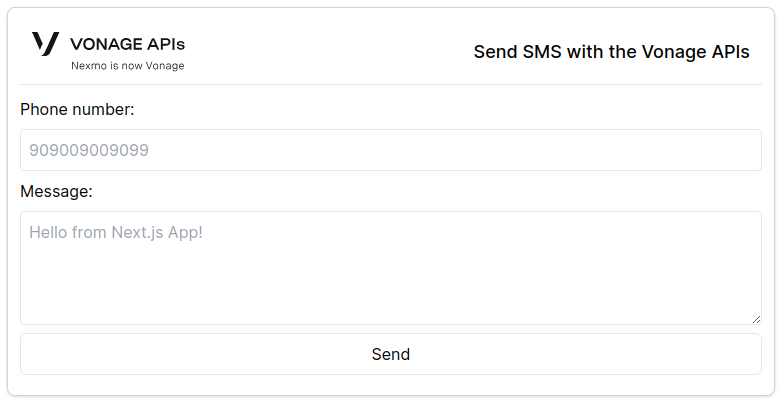

<h1 align="center"> Using Vonage SMS API with Next.js</h1>

This repository has been created for educational purposes, aiming to provide guidance on using the Vonage SMS API with Next.js. You can find the relevant article at the following link: [Coming Soon!](insert_link_here).

## Overview

In this repository, you'll discover sample code for three essential topics:

1. How to send an SMS with Next.js
2. How to receive SMS delivery receipts and handle SMS with Next.js
3. How to add authorization to the webhooks

Explore the provided code examples to gain insights into integrating Vonage SMS functionality into your Next.js applications. Happy learning!

## Preview

It can be used through the website address [vonage-send-sms.vercel.app](https://vonage-send-sms.vercel.app), but you cannot send a SMS, for only preview.

## Screenshot

